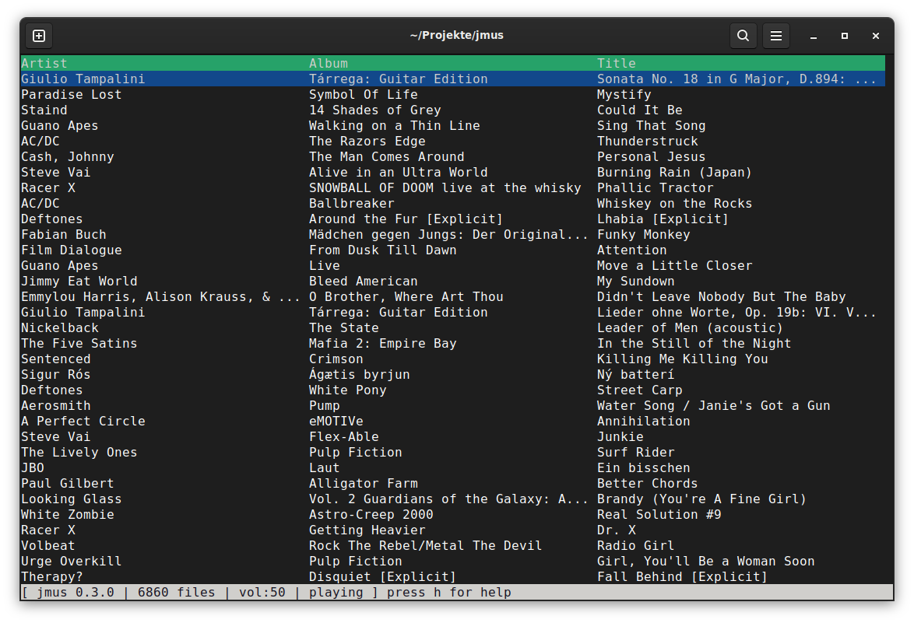

jmus - *J*ava *Mus*ic Player
=============================

A very simple music player to play your local music library on shuffle,
in the console using  [jline](https://jline.org/).

# Play

Provide the folder to your music library on start. jmus will search all of its subfolders
for mp3 files. For now only mp3-Files are played.

```bash
$ jmus ~/Music
```

After scanning for files, jmus starts playing a random song. While playing jmus reads all
track infos, this may take a while, depending on the size of your music library.

At the bottom of the screen is the status line. It shows the version, the number of found
files, the current volume, the current state and all available commands. The commands are
executed by pressing the button in brackets.



## Commands

* `q` - Quit jmus
* `s` - Stop playing
* `p` - Start playing
* `b` - Play the previous song
* `n` - Play the next song
* `+` - Increase the volume
* `-` - Decrease the columne

# Build

To build jmus you need [Maven](https://maven.apache.org/) and a [Java JDK](https://openjdk.org/)
(min. Version 21).

You can build an RPM-Package and install it:

```bash
$ mvn package rpm:rpm
```

Install the generated rpm package with:

```bash
$ sudo dnf install target/rpm/jmus/RPMS/noarch/jmus-0.2.0-1.noarch.rpm
```

# Log

jmus creates a log file in your home folder `.jmus.log`. The file is cleared on every start.

# Dependencies

- [vlc](https://code.videolan.org/videolan/vlc) for playback

